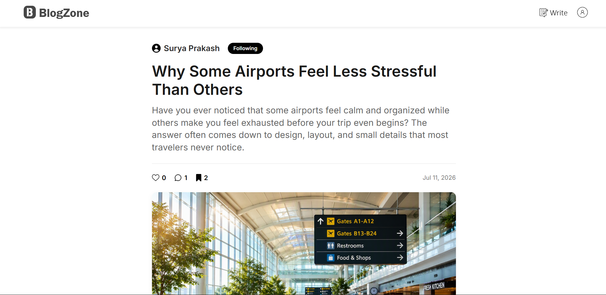
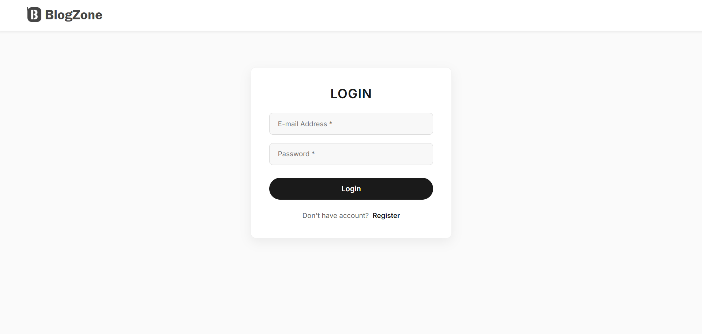
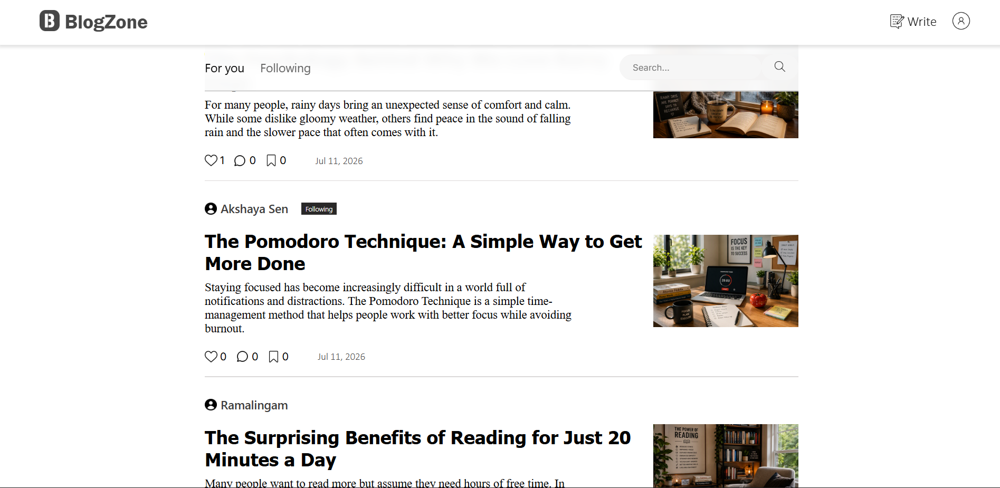

# 📝 Blog-Zone

**Blog-Zone** is a feature-rich full-stack blog platform that allows users to create, read, update, and delete blog posts. The platform supports real-time updates, secure authentication, and interactive features to enhance the user experience. Built with a focus on clean architecture and a fully responsive, premium UI, it offers functionalities like post liking, commenting, saving, and search filtering. Users can also follow other bloggers for personalized content recommendations.

---

## 📸 Screenshots

<p align="center">
  
  &nbsp;
  
</p>
<p align="center">
  
</p>

---

## ✨ Features

- **📱 Fully Responsive UI**: A premium, fluid design that scales flawlessly across desktop, tablet, and mobile devices.
- **✍️ CRUD Operations**: Create, Read, Update, and Delete blog posts using a distraction-free rich text editor.
- **⚡ Real-Time Updates**: AJAX-powered interactions (likes, saves, comments, and follows) update the UI instantly without page reloads.
- **🔒 Secure Authentication**: User login and registration managed by Spring Security, featuring custom validation and mismatch handling.
- **🔍 Search Filtering**: Filter posts based on categories, keywords, and tags.
- **☁️ Cloud-Ready Architecture**: Containerized with Docker and configured for secure cloud database connections via environment variables.
- **🚨 Custom Error Handling**: Sleek, responsive fallback pages (e.g., 404 Page Not Found) to ensure a smooth user experience.

## 🛠️ Technologies Used

- **Backend**: ☕ Java, Spring Boot, Spring Security
- **Database**: 🐬 MySQL (Configured for Aiven Cloud Database)
- **Persistence**: 🗄️ Spring Data JPA / Hibernate
- **Frontend**: 🌐 HTML5, CSS3 (Modern Flexbox/Grid), JavaScript (Fetch API/AJAX), Thymeleaf, CKEditor
- **Deployment**: 🐳 Docker, Render

## 🚀 Setup and Installation

### 📋 Prerequisites

- Java 17 (or higher)
- Maven
- MySQL database (Local or Cloud like Aiven)
- Docker (Optional, for containerized deployment)

### 💻 Local Environment Setup

1. **Clone the repository**:
    ```bash
    git clone https://github.com/Ramalingam-N/Blog-Zone.git
    cd Blog-Zone
    ```

2. **Set up the Environment Variables**:
    To keep credentials secure, this project uses environment variables for database connections. Set the following variables in your local environment or IDE:
    ```bash
    DB_URL=jdbc:mysql://localhost:3306/BLOGZONE?createDatabaseIfNotExist=true
    DB_USERNAME=your_database_username
    DB_PASSWORD=your_database_password
    ```

3. **Build the project**:
    ```bash
    mvn clean install
    ```

4. **Run the application**:
    ```bash
    mvn spring-boot:run
    ```

5. **Access the application** at `http://localhost:8080` in your browser.

### 🐳 Docker Deployment

To run the application using Docker:

1. Build the Docker image:
    ```bash
    docker build -t blog-zone .
    ```
2. Run the container (passing in your database credentials):
    ```bash
    docker run -p 8080:8080 -e DB_URL='your_url' -e DB_USERNAME='your_username' -e DB_PASSWORD='your_password' blog-zone
    ```

## 💡 Usage

- **👤 Register/Login**: Create a new account or log in to the platform.
- **📢 Publish**: Use the rich-text editor to draft and publish articles with cover images.
- **❤️ Engage**: Like, comment on, and save posts from the feed.
- **🧭 Discover**: Search for posts using keywords or view personalized feeds by following other authors.
- **📊 Profile Management**: Track your followers, following, saved posts, and published articles from your dedicated dashboard.

## 🤝 Contributing

1. Fork the repository.
2. Create your feature branch: `git checkout -b feature/your-feature`.
3. Commit your changes: `git commit -m 'Add new feature'`.
4. Push to the branch: `git push origin feature/your-feature`.
5. Create a pull request.

## 📄 License

This project is licensed under the MIT License.
